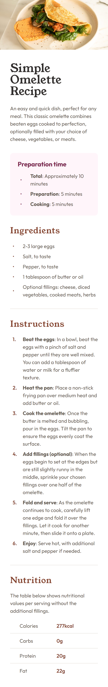
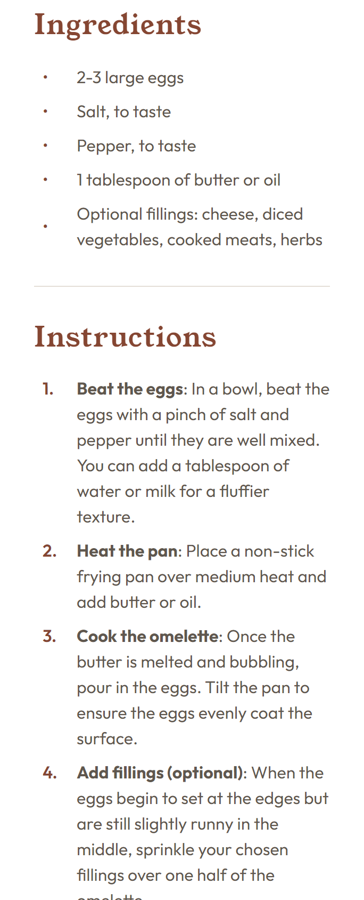
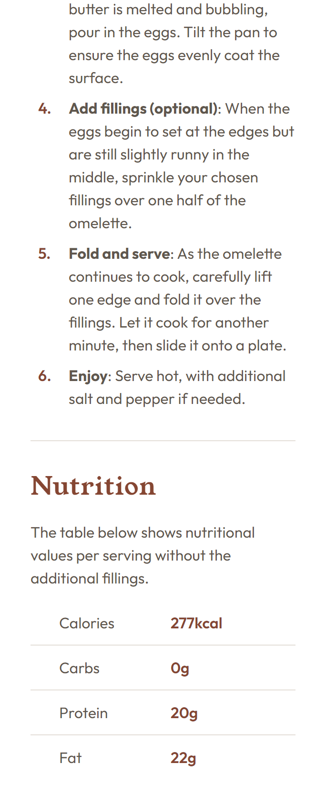
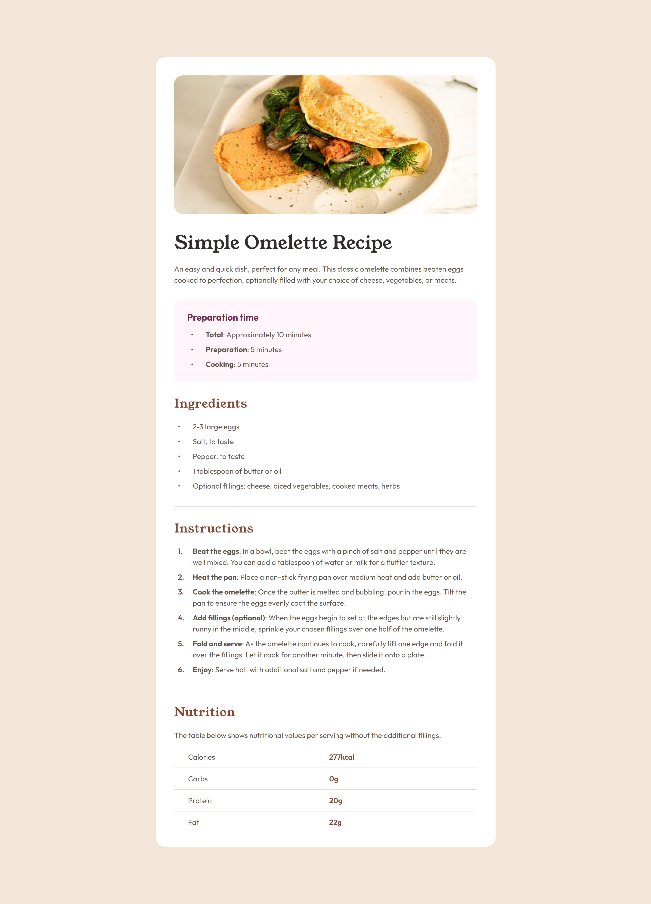

# Frontend Mentor - Recipe page solution

This is a solution to the [Recipe page challenge on Frontend Mentor](https://www.frontendmentor.io/challenges/recipe-page-KiTsR8QQKm). Frontend Mentor challenges help you improve your coding skills by building realistic projects. 

## Table of contents

- [Overview](#overview)
  - [The challenge](#the-challenge)
  - [Screenshot](#screenshot)
  - [Links](#links)
- [My process](#my-process)
  - [Built with](#built-with)
  - [What I learned](#what-i-learned)
  - [Continued development](#continued-development)
  - [Useful resources](#useful-resources)
- [Author](#author)

## Overview

### The challenge

- To build out the simple omelette recipe page and get it looking as close to the design as possible.

### Screenshot

<figure style="height:auto;width:100%;width:auto;display:flex;flex-direction:row;flex-wrap:wrap;justify-content:center;text-align:center">
    <div style="display:flex;flex-direction:row;flex-wrap:wrap;justify-content:center;align-content:center;row-gap:5px;width:100%">
        
        
        
        
        
    </div>
    <figcaption style="flex:1;width:100;font-style:italic">
        My solution for mobile (first four images) and desktop (last photo) devices
    </figcaption>
</figure>


### Links

- Solution URL: [GitHub](https://github.com/MiloosN5/FrontendMentor_RecipePageMain)
- Live Site URL: [GitHub Pages](https://miloosn5.github.io/FrontendMentor_RecipePageMain/)

## My process

### Built with

- Semantic HTML5 markup
- SASS/SCSS
- BEM
- Flexbox
- Grid
- Mobile-first workflow
- REM (Root EM) & EM (for Responsive)
- Responsive layout
- [Angular](https://angular.dev/) - WebApp Framework
- Components
- TypeScript

### What I learned

**Angular Organization via Components** <br>

- Despite being small project, it can still help you understand how to approach your projects, paying attention to the smaller parts. In Angular, It is achieved using "Components". Each component has three parts:
    * Template (.html)
    * Style (.css/.scss)
    * Class (.ts) <br>
- For components, you usually put components (reusable) or layout (probably used only one but it help code be more organizable and readable). 
In this project, there are both of them. For instance, 'Ingredients' part can be make as a component in order to have better control of the app/website, focusing only on this part. According to the design of this project, the 'Ingredients' part is the unique part of the design, so it can be seen as a layout. However, if it was bigger project, there might be other parts that have the same structure but different content. In that case, we can make one component with certain structure to serve for the multiple different parts of the design. The only thing that can vary is the content that can be handled using data binding.

   * app.component.html
        ```html
        <div class="page">
            <main>
                <app-hero></app-hero>
                <app-preparation></app-preparation>
                <app-ingredients></app-ingredients>
                <app-divider-section></app-divider-section>
                <app-instructions></app-instructions>
                <app-divider-section></app-divider-section>
                <app-nutrition></app-nutrition>
            </main>
        </div>
        ```

**Link reusable components with their parent via data binding (@Input)**

- In this project, we have multiple lists. The code can be simplified with creating 'list-ordered' and 'list-unordered' components. However, there are multiple unordered lists in the design. In order to not make separate component for each of them, we can make a skeleton (structure) and then pass content to that component. It can be achieved using 'data-binding' (property binding []). For instance, we have 'Ingredients' and 'Preparation-time' both having 'list-unordered' component. Then, we can use [] as binding data from the 'source' (parent - Ingredients) to the view (child - ListUnordered). The parent property will be binded to the input property (@Input) of the child component. Now, after child data has new value, we want to show it in the template of the child component. It can be done using {} that is known as interpolation (bind property from .ts to the .html).

   * Ingredients & list-unordered
        ```html
        <section class="ingredients">
            <h2>Ingredients</h2>
            <!-- Child (using data binding []) -->
            <app-list-unordered          
                listType="ingredients" 
                [ingredientsItems]="ingredientsList" 
                listStyle="standard"
            ></app-list-unordered>
        </section>
        ```
        ```ts
        export class IngredientsComponent {
            ingredientsList: string[] = [ // parent data
                '2-3 large eggs',
                'Salt, to taste',
                'Pepper, to taste',
                '1 tablespoon of butter or oil',
                'Optional fillings: cheese, diced vegetables, cooked meats, herbs'
            ];
        }
        ```
        ```html
        <ng-container [ngSwitch]="listType">
            <ul 
                *ngSwitchCase="'ingredients'" 
                [ngClass]="['list--unordered', listStyle]"
            >
                <!-- interpolation {{ }} -->
                <li *ngFor="let item of ingredientsItems">{{item}}</li>
            </ul>
            <ul 
                *ngSwitchCase="'preparation'" 
                [ngClass]="['list--unordered', listStyle]"
            >
                <li *ngFor="let item of preparationItems">
                <span class="text--bold">{{item.title}}</span>: {{item.content}}
                </li>
            </ul>
            <p *ngSwitchDefault>No listType provided</p>
        </ng-container>
        ```
        ```ts
        export class ListUnorderedComponent {
            @Input() listType: string = '';
            @Input() listStyle: string = '';
            @Input() ingredientsItems: string[] = []; // child input data
            @Input() preparationItems: ListItem[] = []; // child input data
        }
        ```

**Simlification of sass code via Mixins**

- To avoid repeatable codes, the mixins are very handy. It can help you create a styling skeleton that can be applied to the different elements. Within it, you can create constant values for properties, allow retrieving passing value when mixin is include or even set default value that can be override. Also, to avoid writing media query, we can add that logic inside a mixin.

    * list-table.component.scss & _mixins.scss
        ```scss
        .list {
            &--table {
                ...
                li {
                    @include m.grid(
                        $grid-template-columns: 1fr, // passing values
                        $mobile-grid-template-columns: repeat(2, 1fr) // passing values
                    );
                    ...
                }
            }
        }
        ```
        ```scss
        @mixin grid(
            $grid-template-columns: 1fr, // default
            $mobile-grid-template-columns: null, // default
            $desktop-grid-template-columns: null // default
        ) {
            display: grid; // constant value
            grid-template-columns: map.get(v.$grid, $grid-template-columns) or $grid-template-columns;
            // handle mobile width range
            @include breakpoint-up('mobile') {
                grid-template-columns: map.get(v.$grid, $mobile-grid-template-columns) or $mobile-grid-template-columns;
            }
            // handle desktop width range
            @include breakpoint-up('desktop') {
                grid-template-columns: map.get(v.$grid, $desktop-grid-template-columns) or $desktop-grid-template-columns;
            }    
        }
        ```


### Continued development

- Striving for even better organization of code by dividing it into components as well as organization for styling (better handling of mixins).


### Useful resources

- [Angular Official](https://angular.dev/) - To understand more about 'component' concepts and other Angular-related concepts, their official website is very handy with the full documentation. Along with that, you can use their old website (https://v17.angular.io/docs).
- [@mixin and @include](https://sass-lang.com/documentation/at-rules/mixin/) - Having all logic in one place is more practical, not only for reusability but also for an easier way to handle changes in style behavior.

## Author

- GitHub - [MiloosN5](https://github.com/MiloosN5)
- Frontend Mentor - [@MiloosN5](https://www.frontendmentor.io/profile/MiloosN5)
- Exercism [milos-novakovic-pro](https://exercism.org/profiles/milos-novakovic-pro)
- LinkedIn [Milos Novakovic](https://www.linkedin.com/in/milos-novakovic-1a9517263/)


